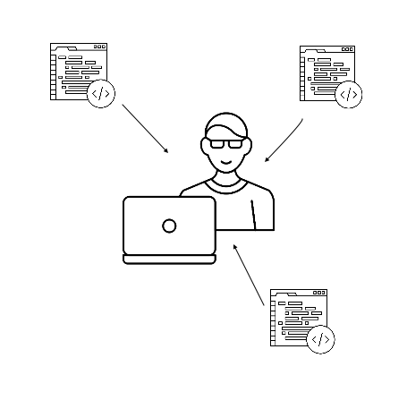

# Operations
### Why is this important?

This lab is a great opportunety for you to create a useful rails app and experiemnet with active records and associations. 


### What are the objectives?

 After this workshop, developers will be able to:
 
  - Create rails application 
  - Create models and implement associations using ActiveRecord
  - CRUD data in the database
  - Practise how to approach many-to-many associations


## Goal
You are managing many developers on your team and each one is working with a different client. You, as the team manager, are going to create a tool for yourself to keep track of your developers and projects. You will be using ruby on rails and postgresql to create this app. 

Follow the instruction and make your team proud! 


<hr>

## Step1: Create Controllroom App

Create a rails app named Controllroom using postgresql.
<details><summary>Can't remember the command?</summary>
 ` $rails new Controllroom -T -d postgresql `
</details>


## Step2: Create Developer Model 

The Developer model should have the following properties:

```
first_name: string
last_name: string
email: string
github_url: string
years_experience: integer

```
create this model using rails command and dont forget to ` rails db:migrate `.

Now jump to the rails cosole and test your model. Create an few developers to use in the future steps.

## Step3: Create Developers Controller
Create the controller for developers and implement these functionalities:

 - See full list of all developers 
 - See information about one specific developer
 - Add new developer to the team

now update the `route.rb` file so anytime a user requests `localhost:3000`, it shows the list of all developers and their information.
 
## Step4: Add Partials
Create a partial in your view to show  all developers information on the page. 

#### Strech goal:

Add the following functionalities to your Developers controller:
 
 - edit/update developer information
 - Remove developer from the team

##Step5: Create Project Model

The Project model should have the following properties:

```
name: string
desc: string
github_url: string
deadline: date

``` 
Don't forgter to run the migration and test the new model in rails console.

## Step6: Associations



Your team is structure allows for:
 
 - Each project to have multiple developers
 - Each developer to be assigned to more than one project

How do you see the association between Developer and Project model? 
Yes! many-to-many. As you know, many-to-many associations are built using join table. Create a model for the joined table and controller to implement this association. 


## Step7: CRUD projects and assignments
first start by creating a few projects in rails console and add developers to it. Then using the controllers you created before plan how you are going to have this process avaibale through the UI. 

What are the things to consider? Can you identify any challanges? 


####Bounes:
- Add navbar as a partial and include "add new developer" option in it
- Finish all CRUD actions for developers
- Add a Client model to the app. Each project should have one client and atleast one developer. 
- Create all CRUD actions for client controller as well.
- Make it look nice! add some styling or JavaScript to this project to enhance the UI.

 
